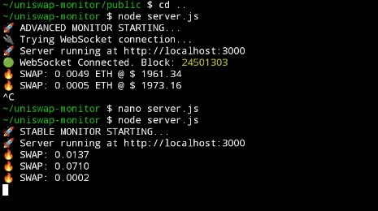
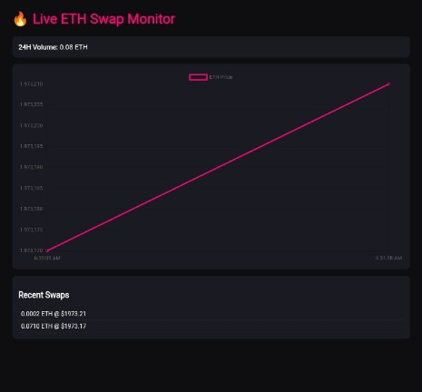

TRAC ADDRESS FOR REWARD : trac1hjs6g37vxvrhwgv46gkywvzzmjxt8c6fd63cs9ex82xp6ckhs2hs3ysuhm


# 🔥 Live ETH Swap Monitor






Real-time ETH swap monitor powered by Uniswap V2 and Alchemy.  
Displays live swaps, ETH price movement, and 24H volume directly in a web dashboard.

Built with Node.js, Express, Socket.io, and Ethers.js.

---

## 🚀 Features

- ✅ Real-time ETH swap tracking
- ✅ Live ETH price chart
- ✅ 24H rolling volume counter
- ✅ Recent swaps feed
- ✅ Stable polling mode (no WebSocket dependency)
- ✅ Clean dark UI
- ✅ Mobile-friendly dashboard

---

## 🛠 Tech Stack

- Node.js
- Express.js
- Socket.io
- Ethers.js (v6)
- Chart.js
- Alchemy RPC

---

## 📡 Data Source

Swaps are monitored from:

Uniswap V2 ETH/USDC Pair (Ethereum Mainnet)

Pair Address:0xB4e16d0168e52d35CaCD2c6185b44281Ec28C9Dc


Network:
Ethereum Mainnet

---

## 📦 Installation

### 1️⃣ Clone Repository

```bash
git clone https://github.com/wishmelucks99s/Uniswap-Monitor-/tree/main.git
cd YOUR_REPO


2️⃣ Install Dependencies

npm install

3️⃣ Add Alchemy API Key

Open server.js and replace:

const API_KEY = "PASTE_ALCHEMY_KEY_DISINI";


With your actual Alchemy API key.
You can get one from: https://www.alchemy.com/�


▶️ Run Server

node server.js


📁 Project Structure

uniswap-monitor/
│
├── server.js
├── package.json
├── node_modules/
└── public/
    └── index.html


📊 How It Works

-Polls Ethereum mainnet every 3 seconds
-Queries Swap events from Uniswap V2 pair contract
-Extracts ETH amount & price
-Emits data via Socket.io
-Frontend updates chart + recent swaps live


⚙️ Configuration

You can modify:
Polling interval:

setInterval(pollSwaps, 3000);


Filter small swaps: Add condition inside swap handler:

JavaScript

if (ethAmount < 1) return;


🔒 Stability


This version uses Polling Mode instead of WebSocket
to prevent:
-WS disconnect issues
-401 errors
-Idle timeout on free RPC tiers


More stable for:
-Termux
-VPS
-Low-resource environments


⚠️ Disclaimer


This project is for educational and monitoring purposes only. Not financial advice.


TRAC ADDRESS FOR REWARD : trac1hjs6g37vxvrhwgv46gkywvzzmjxt8c6fd63cs9ex82xp6ckhs2hs3ysuhm
